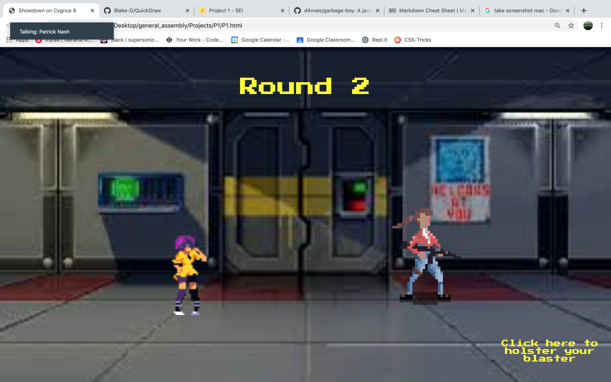
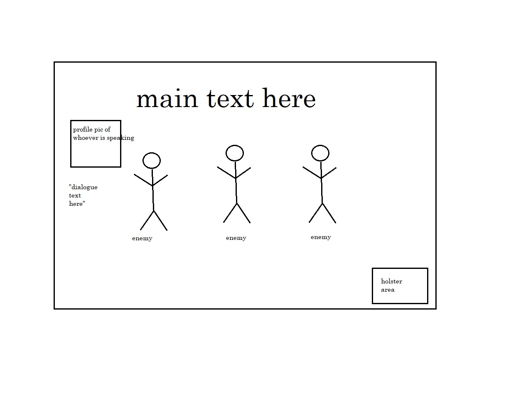

# **SHOWDOWN ON CYGNUS 8**
## **The Setup**

You are an intergalactic bounty hunter who has recently captured a member of a notorious crime syndicate. While taking him back to his home planet to turn him in, your ship runs out of juice and you are forced to stop at the titular space station to refuel.

Once on the station, members of the captured criminal's gang challenge you to a series of quickdraw matches in an attempt to free their comrade.

## **Gameplay**

The player will be challenged to three quickdraw matches against one, two, and three opponents, respectively. 

In each of the three matches, the player must "holster" their weapon by clicking on the bottom-right corner of the screen, and keeping the cursor there until the end of a short count down. (If the player removes the cursor from the area before the end of the countdown, it will stop and wait for the player to "reholster" before resetting.) 

When the count reaches 0, the player must click on the enemies before they deal a killing shot. The enemies will fire shots at different intervals. Not every shot will be a hit. They keep firing until either you hit them or they hit you.

If the player loses a match, they must start from the beginning.

## **Wireframe**

## **MVP**

- Create a sci-fi aesthetic in the style of early 90's pixel games.

- Render a start screen with a brief summary of the backstory and play instructions.

- Render a game screen that contains the following:

    - an area to display game text ("Game Over", "You Win!", etc)

    - three boxes in which enemy sprites appear

    - a box in which the mouse cursor must remain "holstered" before the player can draw

- Render enemy combatants who shoot at the player (with varying degrees of effectiveness) at the end of a countdown. 

    - They will appear in three waves: first a single combatant, then two at a time, then three.

- If the player dies, they can click a button to restart.

## **Stretch Goals**

### Aesthetic

- An expository cutscene prior to gameplay, cycling through a series of static images with text narration.

- Audio assets, such a blaster fire when the player or enemies fires their weapon, and a beeping sound to accompany each increment of the countdown.

- Background music for the cutscene and battle segments, respectively

- Different states for each enemy sprite (pre-draw, gun-drawn, and death) that change depending on the events of the match.

- Display a profile pic of whoever is speaking at any given moment. 

- Muzzle flashes whenever an enemy fires.

- Text displaying whether an enemy shot is a hit or miss.

### Gameplay

After each round, the player will get to sift through the felled combatants' possessions, which will include different types of guns and armor. The player may choose one of the dropped items, which will affect subsequence gameplay by either allowing the player to absorb one or two shots, or shoot two enemies at once, etc.

If this is the case, there will ideally be five rounds instead of three.

## **Tech Stack**

- HTML
- CSS
- Javascript

## **Unresolved Issues**

The character sprites don't re-scale the same way as the background, so I'm not crazy about how it looks as the screen gets smaller.

I'm not 100% certain, but based on my play-tests, it seems like the enemies get more challenging upon replay. It might be because the interval on their attack function isn't cleared when they die. But I'm not sure. I kind of like this feature, in any case.

